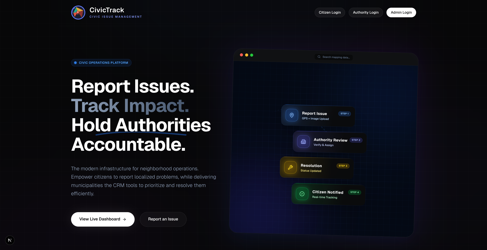
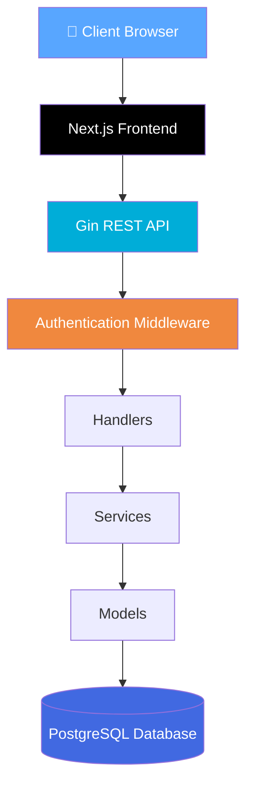
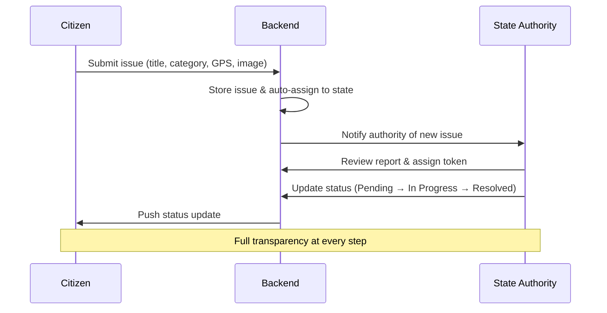
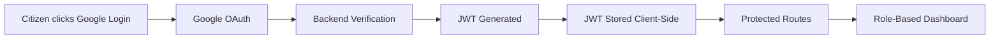
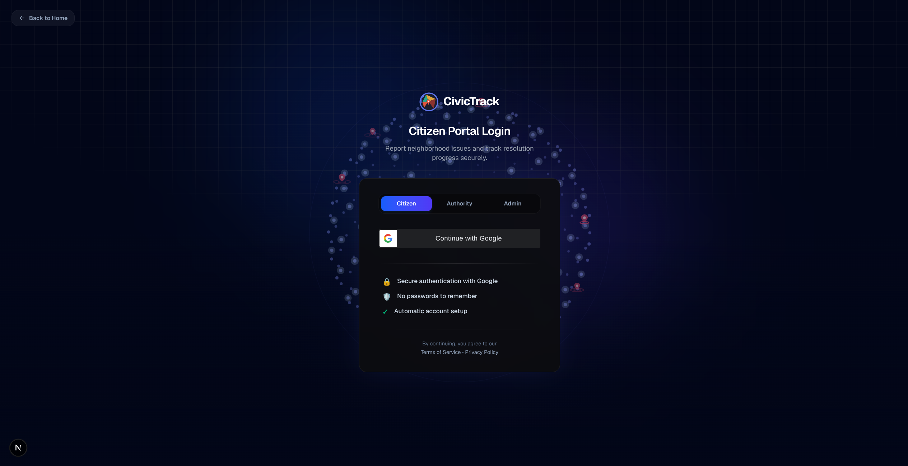

<div align="center">

# 🏙️ CivicTrack

### Intelligent Civic Issue Management Platform

**Bridging the gap between citizens and local government through transparent, real-time issue tracking.**

[
](https://go.dev/)

[](https://www.typescriptlang.org/)
[](https://www.postgresql.org/)
[](https://tailwindcss.com/)

[](LICENSE)
[](CONTRIBUTING.md)
[](https://gin-gonic.com/)
[](#-authentication--security)

[Live Demo](#) · [Report Bug](#) · [Request Feature](#) · [Documentation](#-api-overview)

</div>

<br />

<p align="center">
  
</p>

---

## 📖 Table of Contents

- [About The Project](#-about-the-project)
- [The Problem](#-the-problem)
- [Key Features](#-key-features)
- [User Roles](#-user-roles)
- [Tech Stack](#-tech-stack)
- [System Architecture](#-system-architecture)
- [Application Workflow](#-application-workflow)
- [Project Structure](#-project-structure)
- [Getting Started](#-getting-started)
- [API Overview](#-api-overview)
- [Screenshots](#-screenshots)
- [Roadmap](#-roadmap)
- [Why This Project](#-why-this-project)
- [Contributing](#-contributing)
- [License](#-license)

---

## 💡 About The Project

**CivicTrack** is a modern, full-stack civic issue management platform that empowers citizens to report public infrastructure problems — potholes, garbage overflow, water leakage, broken streetlights, and more — while giving government authorities dedicated tools to review, prioritize, assign, and resolve those issues efficiently.

Unlike traditional complaint portals that disappear into paperwork, CivicTrack is built around:

| Pillar | Description |
|---|---|
| 📍 **Live Issue Tracking** | Every report is trackable from submission to resolution |
| 🏛️ **Role-Based Dashboards** | Tailored experiences for citizens, authorities, and admins |
| 🗺️ **Geographic Reporting** | Automatic GPS capture for accurate issue location |
| 🔄 **Real-Time Status Updates** | Citizens stay informed at every stage |
| 🎨 **Modern UI/UX** | A responsive, dark-themed, animation-rich interface |

---

## ❗ The Problem

Citizens routinely report civic issues like potholes, garbage overflow, water leakage, and broken streetlights — but these complaints typically:

- ❌ Disappear into paperwork
- ❌ Lack transparency
- ❌ Have no tracking mechanism
- ❌ Provide zero status updates
- ❌ Result in no accountability

**CivicTrack digitizes the complete issue lifecycle**, replacing opacity with a transparent, end-to-end tracking system.

---

## ✨ Key Features

### 🔐 Authentication & Security
- Google OAuth 2.0 sign-in
- JWT-based session management
- Role-based authorization (Citizen / Authority / Admin)
- Protected routes and secure middleware validation

### 📝 Issue Reporting
- Report categories: potholes, garbage, water leakage, street lights, roads, drainage, and more
- Image upload support
- Automatic GPS coordinate capture via the Browser Geolocation API
- Priority tagging and rich descriptions

### 🗺️ Interactive Maps
- Location-based issue visualization
- Simplified, map-driven issue identification

### 📊 Issue Tracking & Lifecycle
- Live status: `Pending` → `In Progress` → `Resolved`
- Full timeline with authority assignment history
- Detailed issue pages with images, GPS data, and reporter info

### 🏛️ Authority Dashboard
- State-scoped issue visibility
- Filter, assign, and manage issue tokens
- Approve or reject submissions
- Update status in real time

### 🖥️ Responsive, Modern UI
- Dark theme with glassmorphism accents
- Smooth Framer Motion animations
- Fully responsive across devices

---

## 👥 User Roles

CivicTrack is built on a three-tier role system, ensuring accountability at every level.

<table>
<tr>
<td width="33%" valign="top">

### 🙋 Citizen
- Sign in with Google
- Report new civic issues
- Upload photos & set priority
- Auto-capture GPS location
- Track submitted issues
- View authority responses

</td>
<td width="33%" valign="top">

### 🏢 State Authority
- Secure authenticated login
- View issues within their state only
- Review & validate reports
- Assign issue tokens
- Update issue status
- Reject invalid reports

</td>
<td width="33%" valign="top">

### 🛡️ Super Admin
- Full platform oversight
- Manage all state authorities
- View nationwide issue data
- Create authority accounts
- Monitor platform activity

</td>
</tr>
</table>

> This decentralized structure means every state manages its own issue queue, while the Super Admin retains complete national oversight.

---

## 🛠️ Tech Stack

<table>
<tr>
<td valign="top" width="50%">

**Frontend**

| Technology | Purpose |
|---|---|
| Next.js | React framework & routing |
| React | UI library |
| TypeScript | Type-safe development |
| Tailwind CSS | Utility-first styling |
| Framer Motion | Animations |
| Lucide / React Icons | Iconography |

</td>
<td valign="top" width="50%">

**Backend**

| Technology | Purpose |
|---|---|
| Go (Golang) | Core backend language |
| Gin Framework | REST API framework |
| PostgreSQL | Relational database |
| Google OAuth | Identity provider |
| JWT | Session & auth tokens |

</td>
</tr>
</table>

---

## 🏗️ System Architecture



---

## 🔄 Application Workflow

### Issue Lifecycle



### Authentication Flow



---

## 📁 Project Structure

<table>
<tr>
<td valign="top" width="50%">

**Backend**
```
backend/
├── internal/
│   ├── handlers/     # Request handlers
│   ├── middleware/   # Auth & validation
│   ├── models/       # Data models
│   └── services/     # Business logic
└── main.go           # Entry point
```

</td>
<td valign="top" width="50%">

**Frontend**
```
frontend/
├── app/               # Next.js app router
├── components/        # Reusable UI components
├── hooks/             # Custom React hooks
├── public/            # Static assets
└── styles/            # Global styling
```

</td>
</tr>
</table>

---

## 🚀 Getting Started

### Prerequisites

Make sure you have the following installed:

- [Node.js](https://nodejs.org/) `v18+`
- [Go](https://go.dev/) `v1.21+`
- [PostgreSQL](https://www.postgresql.org/) `v14+`
- A [Google Cloud OAuth](https://console.cloud.google.com/) client ID & secret

### Installation

1. **Clone the repository**
   ```bash
   git clone https://github.com/your-username/civictrack.git
   cd civictrack
   ```

2. **Backend setup**
   ```bash
   cd backend
   cp .env.example .env   # Configure DB, JWT secret, OAuth keys
   go mod tidy
   go run main.go
   ```

3. **Frontend setup**
   ```bash
   cd frontend
   cp .env.example .env.local   # Configure API URL & Google client ID
   npm install
   npm run dev
   ```

4. **Access the app**

   Open [civic-track](https://civic-track-zeta.vercel.app/) in your browser. 🎉

### Environment Variables

| Variable | Description | Location |
|---|---|---|
| `DATABASE_URL` | PostgreSQL connection string | Backend |
| `JWT_SECRET` | Secret key for signing JWTs | Backend |
| `GOOGLE_CLIENT_ID` | Google OAuth client ID | Backend & Frontend |
| `GOOGLE_CLIENT_SECRET` | Google OAuth client secret | Backend |
| `NEXT_PUBLIC_API_URL` | Base URL of the backend API | Frontend |

---
## 🔑 Demo Credentials

Use the following credentials to explore the different dashboards.

> **Citizen Login**
>
> - Authentication: **Google OAuth**
> - Simply click **Continue with Google** on the login page.

---

### 🏢 State Authority

| Field | Value |
|-------|-------|
| Email | `statename_auth@civictrack.com` |
| Password | `statename@123` |

---

### 🛡️ Super Admin

| Field | Value |
|-------|-------|
| Email | `admin@civictrack.com` |
| Password | `admin@123` |

> ⚠️ These are demo credentials intended for testing and showcasing the application.
---
## 📡 API Overview

CivicTrack exposes a REST API built with Gin, secured via JWT and role-based middleware.

| Category | Description |
|---|---|
| **Authentication** | Google OAuth login, JWT issuance & refresh |
| **Issue Management** | Create, list, update, and view civic issues |
| **Status Updates** | Transition issues through their lifecycle |
| **Authority Dashboard** | State-scoped issue queries and assignment |
| **User Management** | Profile and account operations |
| **Role Verification** | Middleware-enforced access control |

> 📘 Full endpoint documentation is available in [`/docs/api.md`](docs/api.md) *(coming soon)*.

**Security measures include:**
- JWT-based authentication on all protected routes
- Role-based authorization middleware
- Server-side request validation
- Secure Google OAuth verification flow

---

## 🖼️ Screenshots

<div align="center">

| Landing Page | Citizen Dashboard |
|---|---|
|  |  |

| Authority Dashboard | Admin Dashboard |
|---|---|
|  |  |

| Issue Details | Report Issue Form |
|---|---|
|  |  |

| Login Page | Map View |
|---|---|
|  |  |

</div>


## 🎯 Why This Project

CivicTrack was built to demonstrate production-grade, full-stack engineering across the entire application lifecycle:

- ✅ Scalable backend architecture in Go
- ✅ Secure authentication & role-based access control
- ✅ RESTful API design
- ✅ Relational database design in PostgreSQL
- ✅ Modern, responsive frontend engineering
- ✅ Real-world problem solving with measurable civic impact

**Skills demonstrated:** Next.js · React · TypeScript · Tailwind CSS · Go · Gin · PostgreSQL · JWT · Google OAuth · REST APIs · RBAC · Geolocation APIs · Full-Stack System Design

---

## 🤝 Contributing

Contributions are what make the open-source community thrive. Any contributions you make are **greatly appreciated**.

1. Fork the project
2. Create your feature branch (`git checkout -b feature/AmazingFeature`)
3. Commit your changes (`git commit -m 'Add some AmazingFeature'`)
4. Push to the branch (`git push origin feature/AmazingFeature`)
5. Open a Pull Request

Please read [`CONTRIBUTING.md`](CONTRIBUTING.md) for our code of conduct and PR process.

---

## 📄 License

Distributed under the **MIT License**. See [`LICENSE`](LICENSE) for more information.

---

<div align="center">

**Built with ❤️ to make civic accountability transparent and accessible.**

⭐ Star this repo if you find it useful!

</div>
